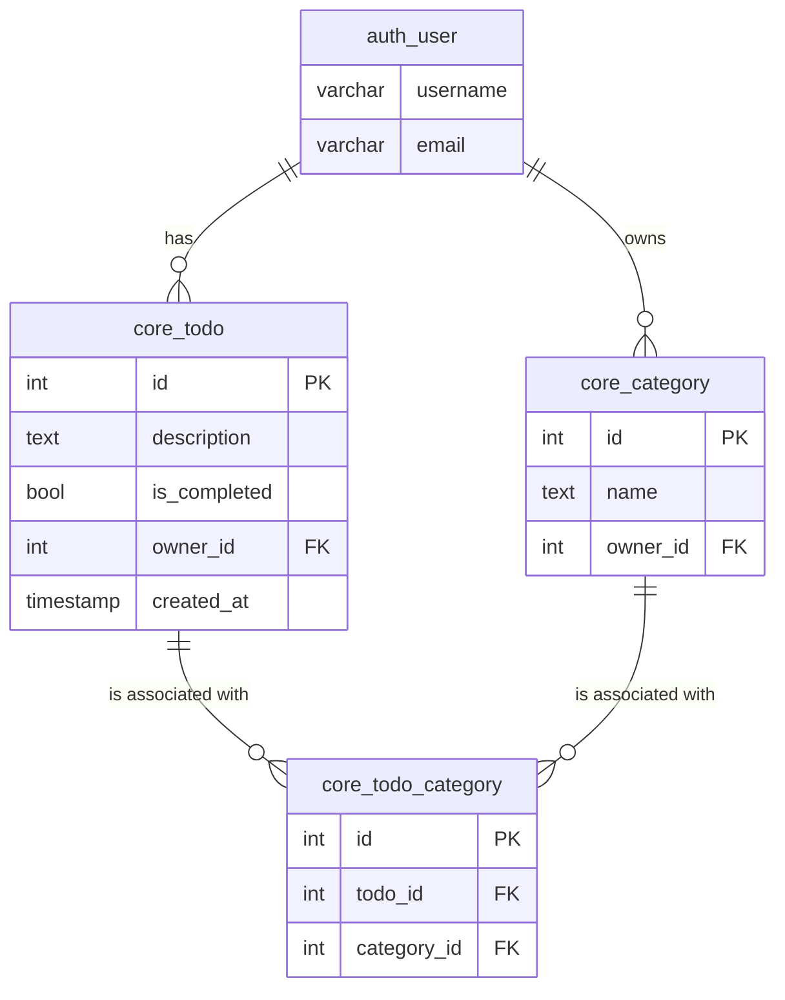

# Todos

Todos application built with Django, PostgreSQL, and React

## Instructions

### Using Docker (recommended)

#### Backend

To start the server, clone the repository and run:

```bash
cd database
docker compose up -d
docker exec -i database-postgres-1 psql -U postgres < db_dump.sql
docker compose down
```

This will populate the database with the dump and populate it with the following user and a set of todos:

- Username: usertest
- Password: usertest123

Then, on the project's root directory:

```bash
docker compose up
```

This will start the Django server on port `8000`, the PostgreSQL database on port '5432', and pgAdmin on port `8888`.

#### Frontend

The client is deployed on [https://andrelucianis.github.io/todos-django-react/](https://andrelucianis.github.io/todos-django-react/) and configured to use the API on localhost.

### Running locally

#### Backend

To run the project locally, you'll need:

- Python 3.12
- Pipenv
- Docker and Docker Compose

Spin up the database:

```bash
cd database
docker compose up
```

Create a virtual environment, migrate, and start the server:

```bash
cd backend
pipenv install
pipenv shell
python manage.py migrate
python manage.py runserver
```

#### Frontend

To run the project locally, you'll need:
- Node

To start the development server, run the command:

```bash
cd frontend
npm install
npm run dev
```

The client will be available on port `5173`

## Project Overview

I've tried to keep everything simple, organized, and functional.

### Backend

To implement all the mandatory requirements, I started by implementing authentication, and I picked the [Knox](https://www.django-rest-framework.org/api-guide/authentication/#django-rest-knox) library due to its simplicity.

For the database models, I wanted to implement the optional "Category" requirement, and to achieve that, I've set the following rules:

- A todo should have only one owner and be protected from other users.
- A todo may have one or more categories.
- A category should have only one owner and be protected from other users.
- A user cannot have categories with the same name.

Here's a diagram with the main tables used in this project:




The "last" steps were to write tests and Dockerize the application.

Under the `/postman` folder, there is a [Postman](https://www.postman.com/) collection to test all the endpoints easily.

### Frontend

For the frontend, besides the project's requirement to use React, I still had to decide between using Next.js or building a SPA. I've picked the latter to keep things simple since the application does not benefit too much from the Next.js features (SEO, caching, etc.).

To develop the client-side code and build it to deploy on GitHub Pages, I've used [Vite](https://vite.dev/) because I'm very familiar with it.

For styling, I wanted to try [shadcn/ui](https://ui.shadcn.com/) since it looks nice and ended up using a lot of the code from the [Tasks](https://ui.shadcn.com/examples/tasks) example, which helped me build the app fairly quickly.

### Comments and Enhancements

Overall, I'm happy with the result. The application works well and satisfies all the mandatory requirements.
But there's always room for improvement, in this case:

- Better test coverage: the test could cover more scenarios to validate all operations happening as they should.
- Frontend tests: No frontend test was implemented. This could improve the development to make sure nothing breaks as the project grows.
- Integrate backend and frontend filters: even though the backend has pagination and filters, the frontend is not using them and, instead, implementing all the logic on the client side. This is room for improvement to make the application more robust and efficient.
- Error handling: On the frontend, the errors could be better handled by identifying common errors, treating them, and, when needed, showing them nicely to the user. Right now, if an error occurs, it is shown on a toast element without any pre-treatment.
- Code clean up: Especially on the frontend code, I see room for improvement. For instance, the `DataTable` and `CreateTodoAndCategoryForm` components are quite complex and could be organized better, and the code could be DRYer overall too.
- Frontend and Backend validations: Some validations could be implemented both on the frontend and backend to prevent weak passwords and invalid emails, or even to limit the amount of Todos or Categories a user can create.
- Responsiveness: Currently the app will break on small screens. This could also be improved to allow users to use the app on mobile devices, for instance.
- Environment variables: I've commited the `.env` files, but this is not a good practice. On a production scenario, these files should be removed and remain on the local repository only and the enviroment variables should be set in a safe place, such as on GitHub Secrets or on the cloud provider used to deploy the application.
